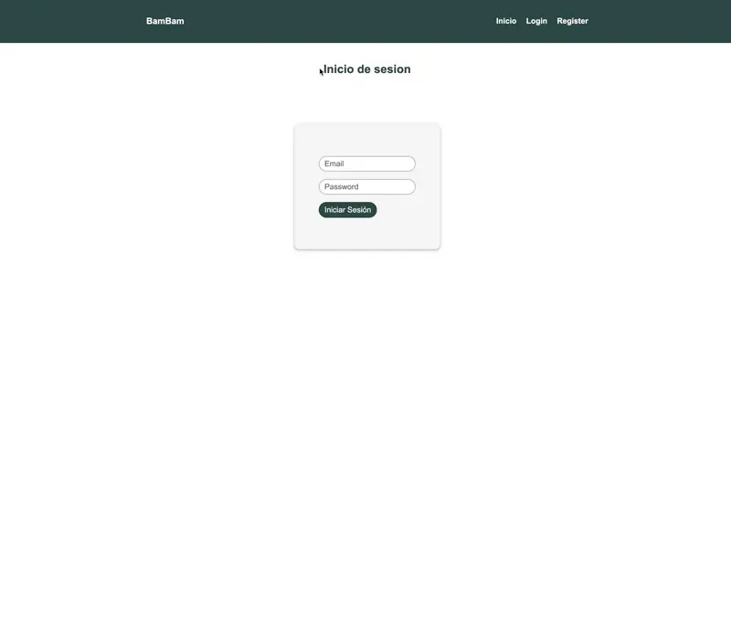
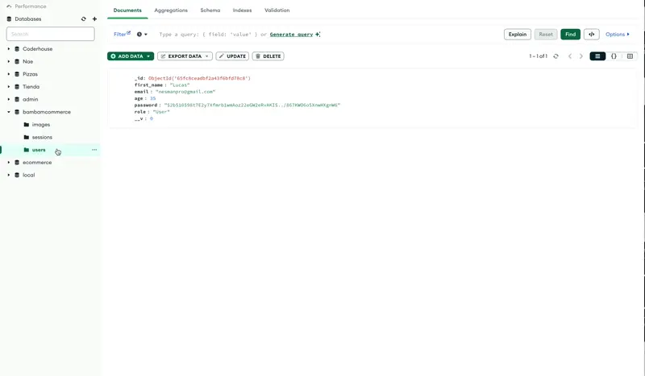

# User Registration and Login App with Image Upload

## Description

This project is a web application for user registration and login, with password hashing for security, session management, and image upload functionality. It uses technologies such as Express.js, Passport.js, Mongoose, Multer, Handlebars, and bcrypt for password hashing.

## Key Features

- **User Registration:** Allows users to sign up for an account with their personal information.
- **User Login:** Provides a secure login mechanism for registered users.
- **Password Hashing:** Safely stores user passwords by hashing them using bcrypt.
- **Session Management:** Manages user sessions using Express-session and stores session data in MongoDB.
- **Image Upload:** Allows users to upload images with titles and descriptions, storing image data in MongoDB.
- **Dynamic Rendering:** Utilizes Handlebars for dynamic rendering of HTML templates.

## Technologies Used

- **Express.js:** Backend web application framework for Node.js.
- **Passport.js:** Authentication middleware for Node.js.
- **Mongoose:** MongoDB object modeling tool designed for Node.js.
- **Multer:** Middleware for handling multipart/form-data (file uploads).
- **Handlebars:** Templating engine for building dynamic web pages.
- **bcrypt:** Library for hashing passwords securely.
- **MongoDB:** NoSQL database for storing user and image data.

## Usage

1. Install dependencies using `npm install`.
2. Ensure MongoDB is running locally or provide a connection string to a MongoDB instance in the code.
3. Run the application using `npm start`.
4. Access the application in a web browser at `http://localhost:8081`.
5. Register for a new account, log in with your credentials, and upload images with titles and descriptions.

## Directory Structure

- `src`: Contains source code files for the application.
  - `config`: Configuration files for Passport.js and other middleware.
  - `database.js`: MongoDB connection setup.
  - `models`: Mongoose models for defining schemas (e.g., image.js, user.js).
  - `public`: Static files such as CSS, client-side JavaScript, and uploaded images.
  - `router`: Express.js router files for different routes.
  - `utils`: Utility functions (e.g., hashbcrypt.js for password hashing).
  - `views`: Handlebars templates for rendering HTML pages.
- `app.js`: Entry point for the application.
